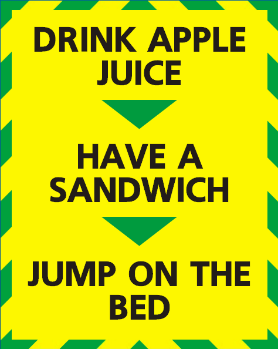
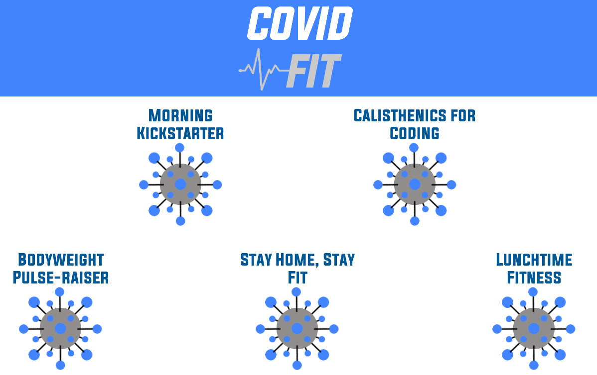
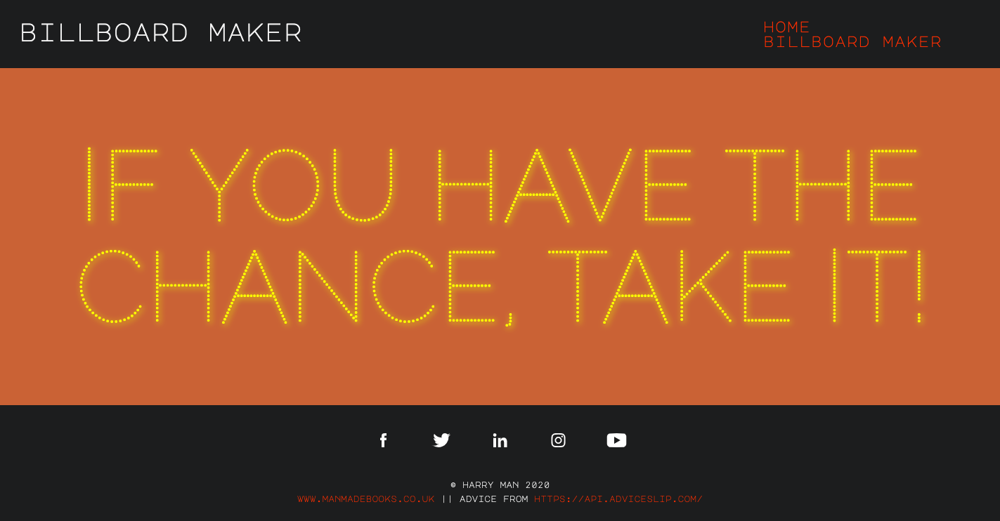

# Portfolio

---

## Recent Projects

---

### Stay Alert-ish

Make your own COVID-19 poster in the style of the UK Government's advice posters.
  [
[On GitHub](/coronaposter/) | [Live](https://harrymandeveloper.github.io/coronaposter/) ]  

---

###  Coronavirus Home Workout Plan 

  A simple React app designed to offer a series of exercises that may be performed to keep fit at home while self-isolating. Features a custom API. 

[ [On GitHub](https://github.com/harrymandeveloper/workoutplan-backend) | [Live](http://bit.ly/covidfitCVlink) ]  
  

---

###  Billboard Maker   

A simple billboard design that queries an external API.  

[ [On GitHub](/billboardmaker/) | [Live](https://harrymandeveloper.github.io/billboardmaker/) ]  

---

### Antique Society  

Built in 48 hours, a technical challenge to precisely match a designer's Photoshop files, to create a dynamic HTML/CSS one page site with transition animations, a parallax effect and a collapsing menu. 

The client wanted a few extra elements: 

Portrait vs landscape orientation changes in CSS behaviour
Collapsing burger menu bar
Font size alterations according to screen size (without using vw)
Menu transition animations
Parallax effect on the jumbotron / hero
Precise font matching and letter spacing matching

[ [On GitHub](/antique-society/) | [Live](https://harrymandeveloper.github.io/antique-society/) ]  

---

